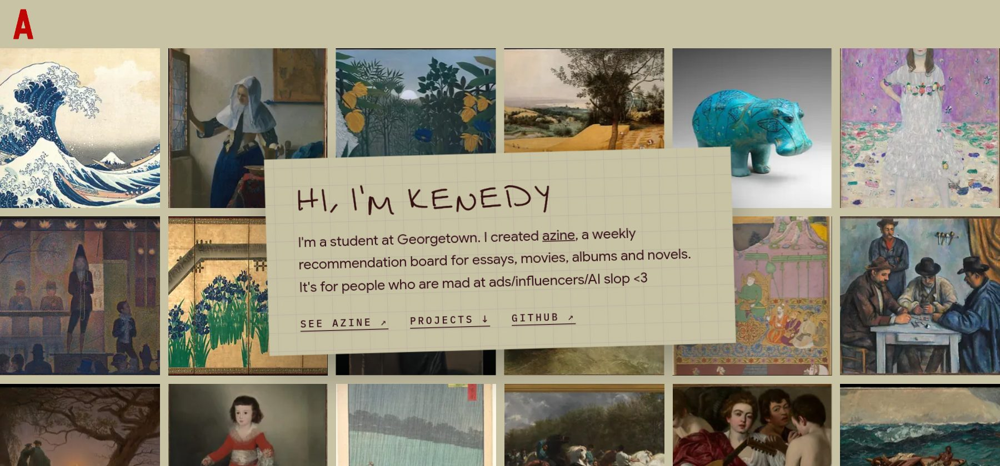
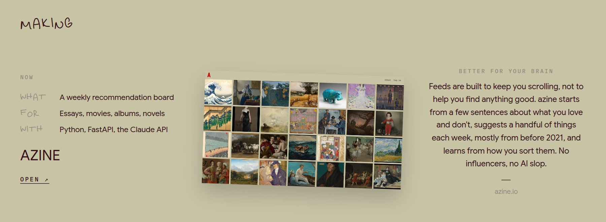
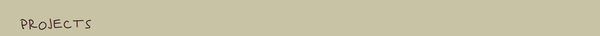
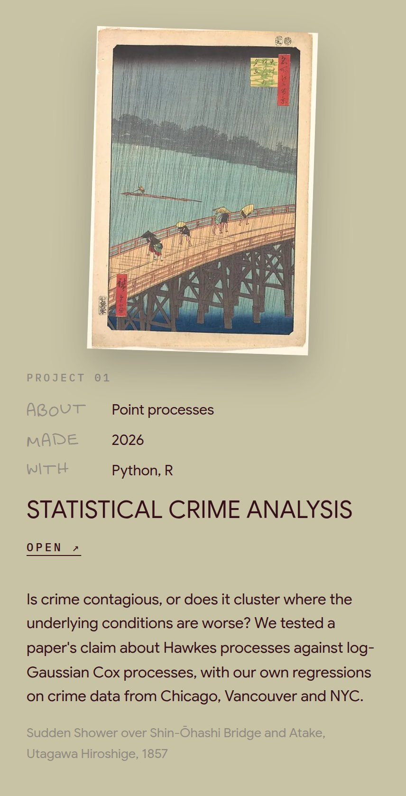
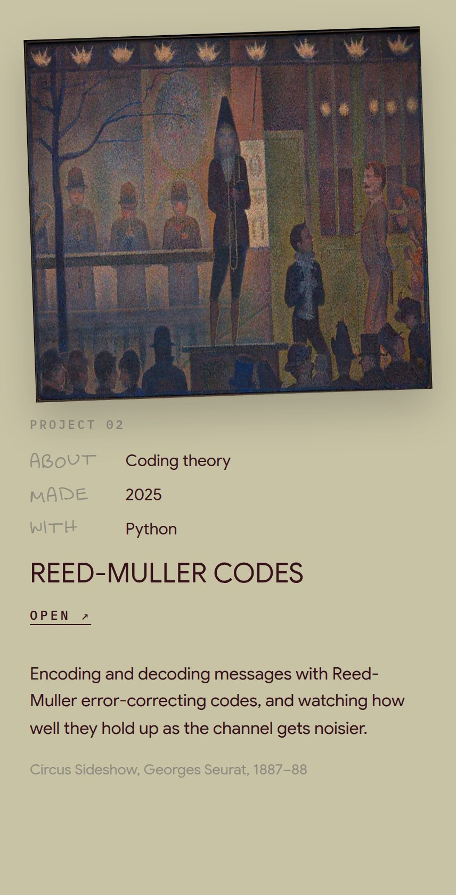
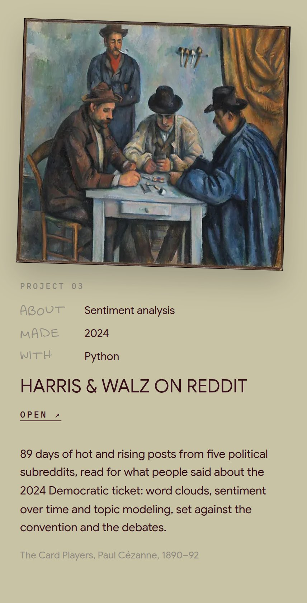
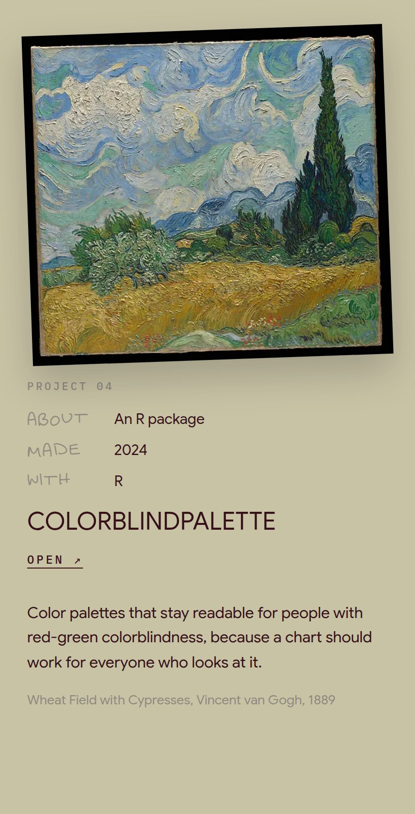
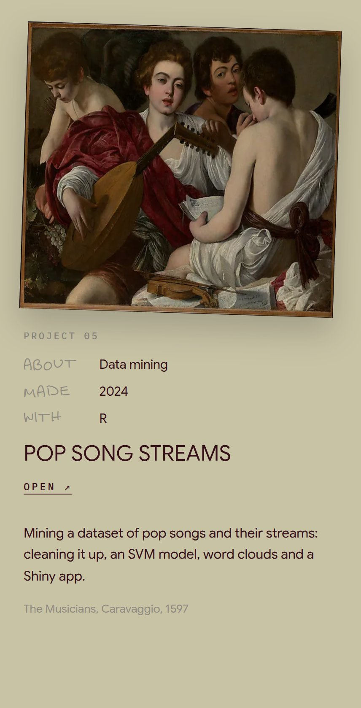
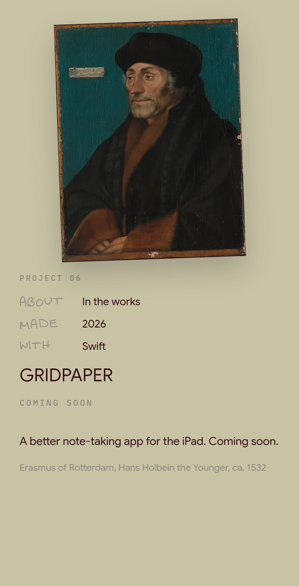
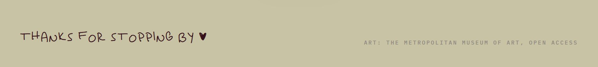

<!-- Profile README: what shows at github.com/kenedyducheine.
     GitHub doesn't allow custom styles here, so each panel is an image
     made from kenedyducheine.github.io (same art, fonts and colors). -->

  <a href="https://kenedyducheine.github.io">kenedyducheine.github.io</a> ·
  <a href="https://azine.io">azine.io</a>

